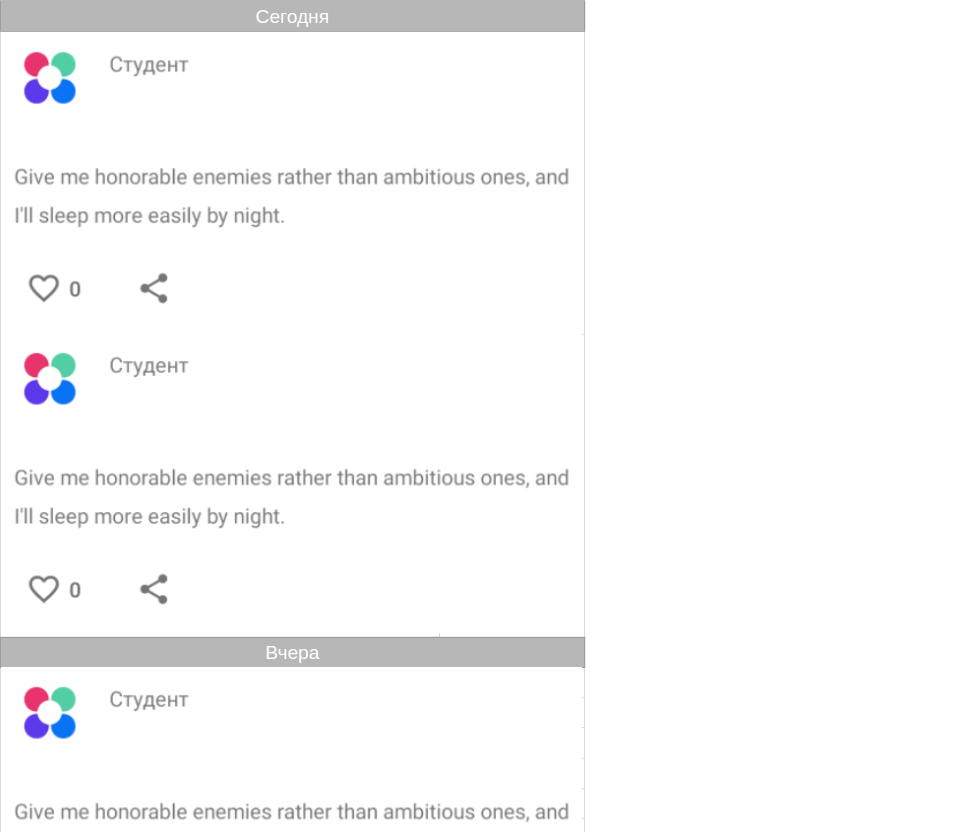

# Домашнее задание к занятию «2.1. RecyclerView — продвинутое использование»

В качестве результата пришлите ссылки на ваш GitHub-проект в личном кабинете студента на сайте [netology.ru](https://netology.ru).

**Важно**: ознакомьтесь со ссылками на главной странице [репозитория с домашними заданиями](../README.md).

**Важно**: если у вас что-то не получилось, оформите Issue [по установленным правилам](../report-requirements.md).

## Как сдавать задачи

1. Откройте ваш проект Android-приложения из предыдущего ДЗ, можете брать код из лекции.
1. Сделайте необходимые коммиты.
1. Сделайте push. Убедитесь, что ваш код появился на GitHub.
1. Ссылку на ваш проект отправьте в личном кабинете на сайте [netology.ru](https://netology.ru).
1. Задачи, отмеченные как необязательные, можно не сдавать. Это не повлияет на получение зачёта.

## Задача. Paging Refresh, Prepend & Append

### Описание

Помимо документации и примеров на GitHub, Google часто оформляет примеры использования определенной технологии в виде [Codelabs](https://codelabs.developers.google.com/?cat=android).

Используя примеры с лекции и [Codelab, посвящённую Paging](https://developer.android.com/codelabs/android-paging), добавьте в код предыдущего проекта, в котором есть Paging, поддержка PREPEND, APPEND и REFRESH, следующее поведение:
1. Refreshing SwipeRefreshLayout отображается только при REFRESH.
1. При PREPEND первым элементом в `RecyclerView` должен быть элемент с загрузкой. 
1. При APPEND последним элементом в `RecyclerView` должен быть элемент с загрузкой.

### Результат

Опубликуйте изменения в виде Pull Request в вашем проекте на GitHub.

В качестве результата пришлите ссылку на PR GitHub-проект в личном кабинете студента на сайте [netology.ru](https://netology.ru)

## Задача. Timing Separators*

**Важно**: это необязательная задача. Её (не)выполнение не влияет на получение зачёта по ДЗ.

### Описание

Используя примеры из лекции, реализуйте separator следующим образом:
1. Сегодня: элементы, опубликованные в пределах от текущего времени до текущего времени — 24 часа.
2. Вчера: элементы, опубликованные в пределах от текущего времени — 24 часа до текущего времени — 48 часов.
3. На прошлой неделе: всё, что старше текущего времени — 48 часов.

Вот так это должно выглядеть схематически:

Вы можете выполнять задачу любым способом, который посчитаете правильным:
* `ItemDecoration`,
* через добавление дополнительных элементов в модель данных.

### Результат

Опубликуйте изменения в виде Pull Request в вашем проекте на GitHub.

В качестве результата пришлите ссылку на PR GitHub-проект в личном кабинете студента на сайте [netology.ru](https://netology.ru).
