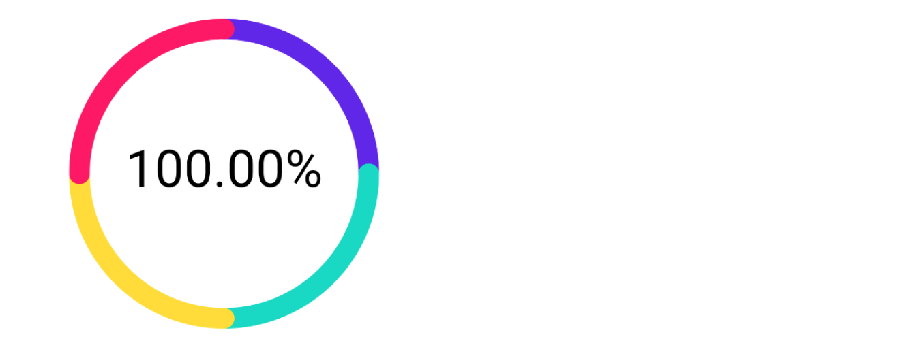
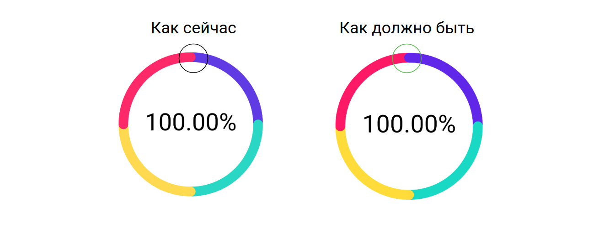
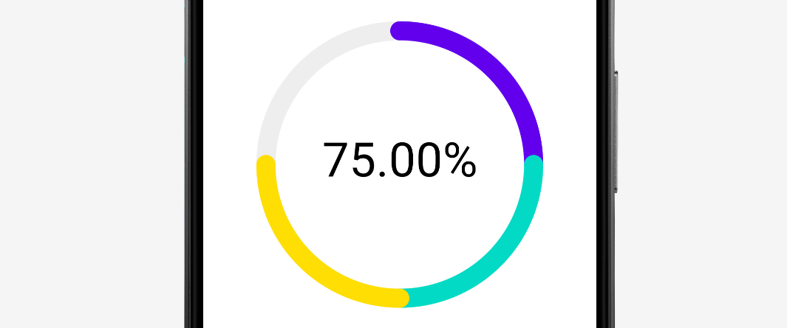

# Домашнее задание к занятию «2.1 Custom Views - разработка собственных элементов интерфейса»

В качестве результата пришлите ссылки на ваш GitHub-проект в личном кабинете студента на сайте [netology.ru](https://netology.ru).

**Важно**: ознакомьтесь со ссылками на главной странице [репозитория с домашними заданиями](../README.md).

**Важно**: если у вас что-то не получилось, оформите Issue [по установленным правилам](../report-requirements.md).

## Как сдавать задачи

1. Создайте новый проект Android приложения, можете брать код с лекции.
1. Сделайте необходимые коммиты.
1. Сделайте пуш (убедитесь, что ваш код появился на GitHub).
1. Ссылку на ваш проект отправьте в личном кабинете на сайте [netology.ru](https://netology.ru).
1. Задачи, отмеченные как необязательные, можно не сдавать, это не повлияет на получение зачета.

## Задача Smart StatsView

### Описание

На текущий момент наша Custom View принимает в качестве данных "доли":

```kotlin
findViewById<StatsView>(R.id.stats).data = listOf(
    0.25F,
    0.25F,
    0.25F,
    0.25F,
)
```

Что в сумме даёт нам картинку из лекции:



**Q**: что мы хотим?

**A**: мы хотим, чтобы `StatsView` принимала на вход данные, по которым сама рассчитывала проценты:

```kotlin
findViewById<StatsView>(R.id.stats).data = listOf(
    500F,
    500F,
    500F,
    500F,
)
```

Что должно давать такую же картинку, т.к. `SmartStatsView` просуммирует все данные и определит, что каждый элемент - это ровно 25%: 


### Результат

Опубликуйте изменения в виде Pull Request'а в вашем проекте на GitHub.

В качестве результата пришлите ссылку на PR GitHub-проект в личном кабинете студента на сайте [netology.ru](https://netology.ru)

## Задача Dot

### Описание

В нашей реализации есть один не очень приятный нюанс:



Исправьте реализацию таким образом, чтобы мы из картинки "Как сейчас" получили картинку "Как должно быть".

### Результат

Опубликуйте изменения в виде Pull Request'а в вашем проекте на GitHub.

В качестве результата пришлите ссылку на PR GitHub-проект в личном кабинете студента на сайте [netology.ru](https://netology.ru)

## Задача Not Filled*

**Важно**: это необязательная задача. Её (не)выполнение не влияет на получение зачёта по ДЗ.

### Описание

Если вы реализовали предыдущую задачу, то заполняемость вашего графика всегда 100%.

Мы хотим сделать так, чтобы можно было иметь и незаполненную часть:



Подумайте, как это можно сделать, и реализуйте.

<details>
<summary>Подсказка</summary>

Возможно, придётся поменять формат входных данных и вспомнить часть про `drawCircle`.
</details>

### Результат

Опубликуйте изменения в виде Pull Request'а в вашем проекте на GitHub.

В качестве результата пришлите ссылку на PR GitHub-проект в личном кабинете студента на сайте [netology.ru](https://netology.ru)
