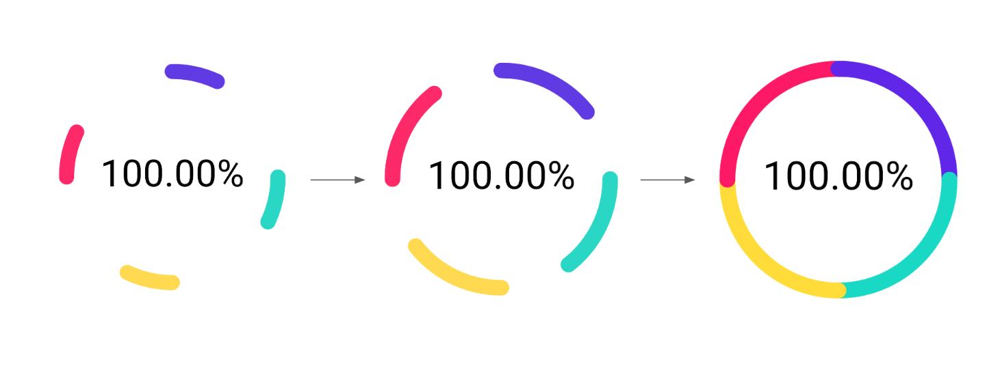
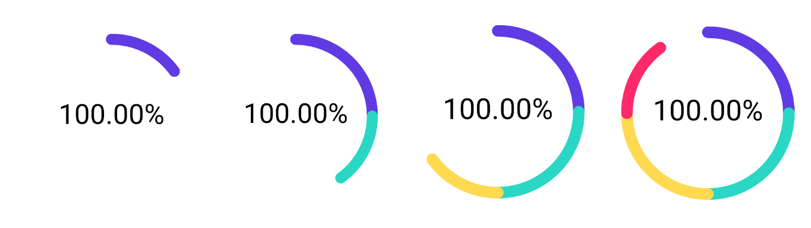

# Домашнее задание к занятию «2.2 Animations - создание анимаций (часть 1)»

В качестве результата пришлите ссылки на ваш GitHub-проект в личном кабинете студента на сайте [netology.ru](https://netology.ru).

**Важно**: ознакомьтесь со ссылками на главной странице [репозитория с домашними заданиями](../README.md).

**Важно**: если у вас что-то не получилось, оформите Issue [по установленным правилам](../report-requirements.md).

## Как сдавать задачи

1. Создайте новый проект Android-приложения, можете брать код с лекции.
1. Сделайте необходимые коммиты.
1. Сделайте push. Убедитесь, что ваш код появился на GitHub.
1. Ссылку на ваш проект отправьте в личном кабинете на сайте [netology.ru](https://netology.ru).
1. Задачи, отмеченные как необязательные, можно не сдавать. Это не повлияет на получение зачёта.

## Задача Rotation

### Описание

Необходимо дополнить реализованную на лекции анимацию поворотом на 360 градусов:

Обратите внимание, что текст остаётся неподвижным

Для решения задачи подумайте:
1. Какой параметр отвечает за прогресс анимации
2. Как перевести его в градусы
3. Какой параметр отвечает за начальный сдвиг при отрисовке каждой «дуги»

## Задача Sequential*

**Важно**: это необязательная задача. Её (не)выполнение не влияет на получение зачёта по ДЗ.

### Описание

На лекции мы реализовали параллельное «заполнение данными»:

Сейчас же мы хотим сделать последовательное:

### Результат

Опубликуйте изменения в виде Pull Request в вашем проекте на GitHub.

В качестве результата пришлите ссылку на PR GitHub-проект в личном кабинете студента на сайте [netology.ru](https://netology.ru)

## Задача Attributes*

**Важно**: это необязательная задача. Её (не)выполнение не влияет на получение зачёта по ДЗ.

### Описание

Если вы выполнили предыдущую задачу, то у вас получилось две реализации «заполнения данными»:
1. Параллельная
2. Последовательная

Сделайте так, чтобы тип заполнения можно было выбирать через XML. Используйте для этого `format="enum"`. В качестве примера реализации смотрите статью на [developer.android.com](https://developer.android.com/training/custom-views/create-view).

### Результат

Опубликуйте изменения в виде Pull Request в вашем проекте на GitHub.

В качестве результата пришлите ссылку на PR GitHub-проект в личном кабинете студента на сайте [netology.ru](https://netology.ru)

## Задача Bidirectional*

**Важно**: это необязательная задача. Её (не)выполнение не влияет на получение зачёта по ДЗ.

### Описание

Предлагаем дополнить параллельное «заполнение данными» следующим режимом:

Если вы выполнили предыдущую задачу, то у вас получилось три реализации «заполнения данными»:
1. Параллельная
2. Последовательная
3. Двусторонняя

### Результат

Опубликуйте изменения в виде Pull Request в вашем проекте на GitHub.

В качестве результата пришлите ссылку на PR GitHub-проект в личном кабинете студента на сайте [netology.ru](https://netology.ru)
