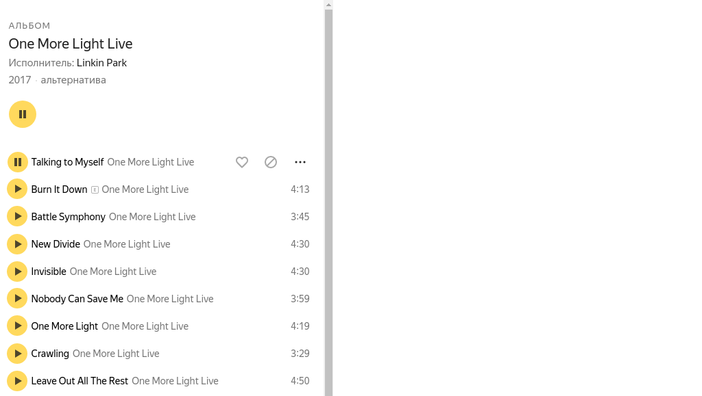

# Домашнее задание к занятию «3.2 Работа с мультимедиа»

В качестве результата пришлите ссылки на ваш GitHub-проект в личном кабинете студента на сайте [netology.ru](https://netology.ru).

**Важно**: ознакомьтесь со ссылками, представленными на главной странице [репозитория с домашними заданиями](../README.md).

**Важно**: если у вас что-то не получилось, то оформляйте Issue [по установленным правилам](../report-requirements.md).

## Как сдавать задачи

1. Создайте новый проект Android приложения (можете брать код с лекции).
1. Сделайте необходимые коммиты.
1. Сделайте пуш (удостоверьтесь, что ваш код появился на GitHub).
1. Ссылку на ваш проект отправьте в личном кабинете на сайте [netology.ru](https://netology.ru).
1. Задачи, отмеченные, как необязательные, можно не сдавать, это не повлияет на получение зачета.

## Мини-проект Single Album App

### Описание

Реализуйте приложение, предназначенное для воспроизведения одного единственного музыкального альбома (адаптированный скриншот сервиса Яндекс.Музыка: вам нужно сделать по его аналогии):

URL, с которого можно получать JSON с нужными данными: https://github.com/netology-code/andad-homeworks/raw/master/09_multimedia/data/album.json (данные любезно предоставлены [SoundHelix](https://www.soundhelix.com)).

URL для композиции можно построить из BASE_URL "https://raw.githubusercontent.com/netology-code/andad-homeworks/master/09_multimedia/data/" + имя файла (поля file из [album.json](https://github.com/netology-code/andad-homeworks/raw/master/09_multimedia/data/album.json))

Весь экран должен представлять собой один `RecyclerView`, который прокручивается. При этом вам нужно реализовать логику воспроизведения (берите за основу [логику веб-версии Яндекс.Музыка](https://music.yandex.ru/artist/36800/albums)).

**Важно**: вы сами решаете, каким образом организовать архитектуру, какие библиотеки использовать и т.д. Например, вряд ли в этом проекте нужен FCM. Возможно, что даже не нужны фрагменты и `Navigation`. А вот по поводу `Room` стоит подумать (например, зачем вам локально список песен, если проигрывать вы их всё равно будете с удалённого сервиса, если только вы их сохраните локально). То же самое относится к Retrofit: ради одного запроса подключать его есть ли смысл? Может просто обойтись OkHttp? В общем, думайте и решайте, главное не забудьте написать в пояснительном тексте к ДЗ, почему вы приняли решение включить именно такие зависимости.

В проекте не должно быть неиспользуемых зависимостей: если вы не используете Room, то и в dependency его быть не должно.

Вы сами решаете, насколько функциональным сделать ваше приложение. Минимальная функциональность:
1. При клике на кнопку Play она заменяется на кнопку Pause.
1. После того, как воспроизведение текущей композиции заканчивается, начинается воспроизведение следующей (после последней воспроизводится первая).
1. `RecyclerView` нормально переиспользует `ViewHolder`'ы - ничего не ломается и состояние не теряется.

### Результат

В качестве результата пришлите в личном кабинете:
1. Ссылку на ваш проект
1. Объяснение выбора используемых библиотек
