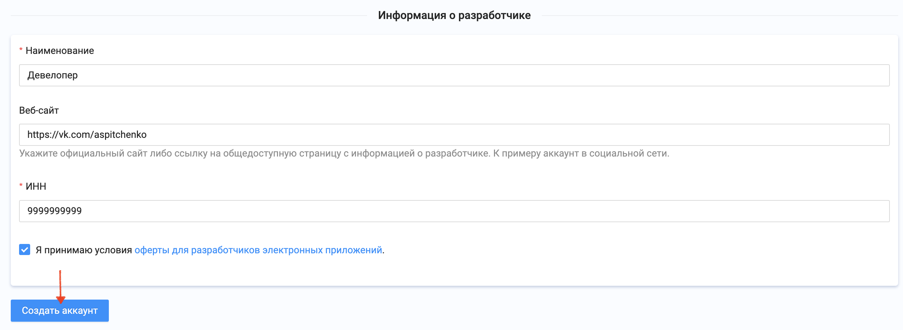

# Публикация приложения в [NashStore](https://store.nashstore.ru/)
## Введение
Система Android позволяет устанавливать приложения при помощи других приложений: магазинов или сторов. Разработчик может распространять, обновлять и продвигать своё приложение, используя возможности стора.

Для примера рассмотрим магазин приложений [NashStore](https://store.nashstore.ru/). Он подойдёт для начинающих: для регистрации не требуется оплачивать регистрационный сбор, в отличие от [Google Play](https://play.google.com/), и не нужно иметь предприятие, как в [RuStore](https://rustore.ru/)

## Регистрация
Для использования NashStore нужно пройти регистрацию для доступа к магазину и отдельно регистрацию аккаунта разработчика. 

Переходим на [страницу регистрации](https://store.nashstore.ru/profile/sign_up)

Вводим свои данные

После успешной регистрации нужно подтвердить email

Далее регистрируем аккаунт разработчика

Заполняем анкету

И нажимаем «Создать аккаунт»

Аккаунт зарегистрирован, но потребуется некоторое время для проверки

В это время мы можем подготовить наше приложение к публикации

## Подготовка

На данном этапе от нас потребуется:
- минимум 2 скриншота
- большая иконка приложения, она создаётся при генерации иконки. [Пример](pic/publication_0)
- apk-файл, собранный в release-версии

Переходим к [консоли разработчика](https://store.nashstore.ru/console). Выбираем созданный аккаунт

Нажимаем «Создать приложение»

Заполняем информацию, которую увидит пользователь

Далее указываем информацию, которая потребуется при возникновении вопросов по приложению

Потребуется иконка и скриншоты

Поскольку в приложении есть функции, доступные только после аутентификации, нужно завести тестовый аккаунт и поделиться им. Это необходимо для проверок и одобрения публикации со стороны магазина

# Публикация

Переходим к вкладке «Управление выпусками» и создаём выпуск

На данном этапе нам потребуется подписанная релизная сборка.

Перед сборкой необходимо придумать уникальный applicationId. 

Как правило, applicationId представляет собой имя сайта наоборот. При этом доменное имя сайта не обязательно должно вам принадлежать. Он должен быть уникален в рамках магазина приложений

Для сборки релиза в Android Studio нужно выбрать данный пункт:

В появившемся окне выбираем Apk

Если на данном этапе есть хранилище ключей (keysore), то можно выбрать существующий. Если нет, нужно его создать (Create New)

При создании keystore указывайте свои данные, которые могут идентифицировать вас как автора. Время жизни ключа побольше — 25 лет хватит

После создания/выбора keystore переходим далее (Next) и выбираем release

Готовый apk должен быть здесь:

В появившемся окне выбираем созданный ранее Apk

Выпуск можно опубликовать

К каждому выпуску можно указывать краткое описание о том, что изменилось

Заключительный этап

Ждём одобрения или отправки на доработку

## Типичные ошибки
Выпуск может быть отправлен на доработку. Чаще всего это происходит по причинам:
1. Указана некорректная информация
2. При сборке apk не была увеличена версия 

Рекомендуем вам подойти к этой задаче ответственно, иначе релиз может не выйти в планируемый срок.
